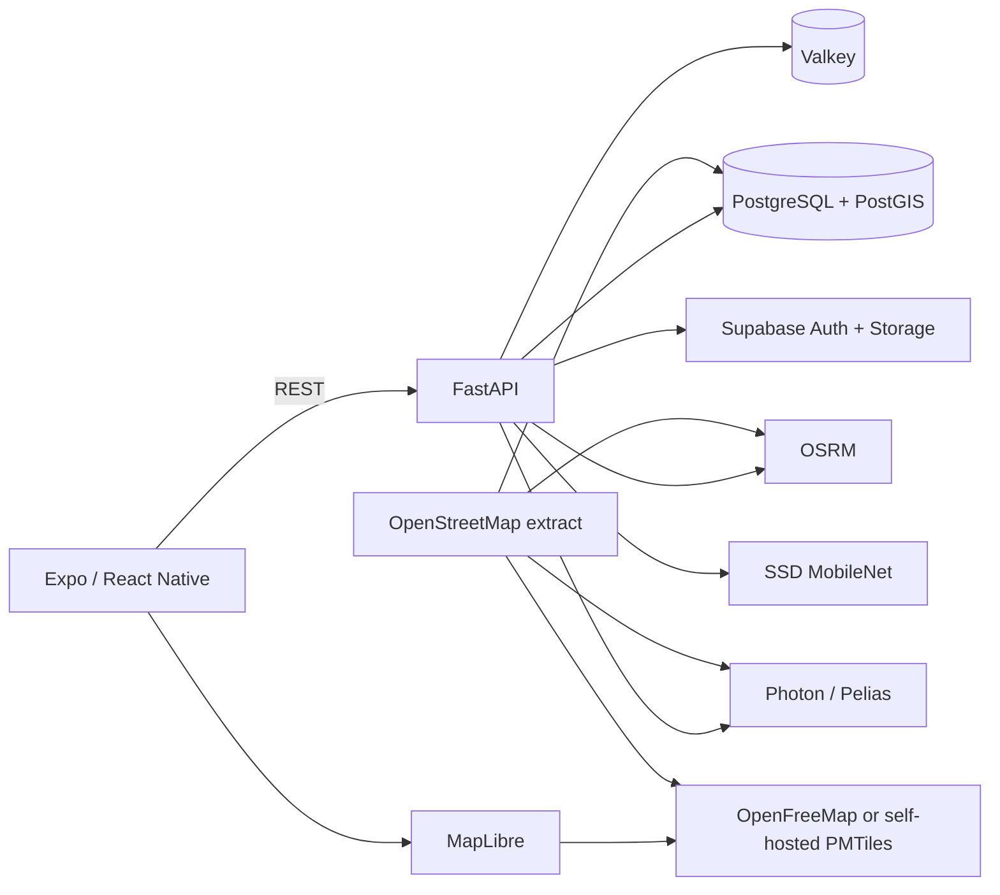

# Pathfinder

**Road-aware route recommendations from crowdsourced surface reports.**

Pathfinder compares real road-following alternatives using travel time, distance, and road quality inferred from user-submitted images. The product is an Expo/React Native client backed by FastAPI, PostgreSQL/PostGIS, Valkey, OpenStreetMap, and a pretrained SSD MobileNet model.

The normal application path is Google-free. Google Maps API methods remain isolated in a server-only research script and are never used as a silent fallback.

**Live web app:** https://ep1cgaimer.github.io/PathFinder/
**API documentation:** https://pathfinder-api-0d3o.onrender.com/docs


## What works

- MapLibre maps on web, Android, and iOS with keyless OpenFreeMap styles.
- OpenStreetMap road geometry highlighted from red through yellow to green.
- Up to three OSRM route alternatives ranked by distance, duration, and observed quality.
- Photon or Pelias autocomplete and forward geocoding.
- Reports snapped to canonical 50 metre OSM road segments in PostGIS.
- Image upload, SSD MobileNet road-damage inference, and confidence-weighted quality aggregation.
- Supabase email/password authentication and contributor-scoped image storage.
- Valkey route caching with explicit data-version invalidation.
- A reproducible Bengaluru data build and a fully credential-free local demo mode.

## Architecture



One Bengaluru OSM extract is the source for routing, autocomplete, road snapping, and the optional self-hosted basemap. That prevents geometry mismatches between the route engine and quality overlay.

## Route scoring

For every candidate route, PostGIS matches route pieces to canonical OSM road segments. Reports on each segment are weighted by model confidence. Sparse coverage is shrunk toward a neutral score so a single observation cannot dominate an entire route.

```text
score = 0.25 * distance_score
      + 0.35 * duration_score
      + 0.40 * effective_road_quality
```

The benchmark command measures the geospatial scoring query separately from external routing latency:

```powershell
cd backend
python scripts/benchmark_geospatial.py
```

The acceptance threshold is warm p95 below 200 ms on the documented Bengaluru dataset.

## Run locally

Prerequisites: Docker Desktop, Python 3.11, Node 22.

```powershell
Copy-Item .env.example .env
docker compose up -d

py -3.11 -m venv .venv
.\.venv\Scripts\python -m pip install -r backend\requirements-dev.txt
Push-Location backend
..\.venv\Scripts\python -m alembic upgrade head
Pop-Location
.\.venv\Scripts\python -m uvicorn backend.app.main:app --reload --port 8000

cd mobile
npm ci
npm run web
```

The defaults use the public OSRM and Photon services without API keys. Set either provider to `demo` for deterministic offline UI work. Native MapLibre requires an Expo development build, not Expo Go:

```powershell
cd mobile
npx expo run:android
```

## Build Bengaluru road data

The reproducible files live in [`infra/osm`](infra/osm). The configured extent is `77.35,12.75,77.85,13.20`.

1. Download Geofabrik Southern Zone OSM data.
2. Extract the configured bounding box with Osmium.
3. Import road ways with the checked-in osm2pgsql flex style.
4. Run `rebuild_segments.sql` to generate approximately 50 metre segments.
5. Build ORS, Photon, and PMTiles from that same extract.

Large PBF files, route graphs, search indexes, and PMTiles archives are intentionally excluded from Git.

## Provider configuration

| Capability | Portfolio mode | Self-hosted mode |
|---|---|---|
| Map tiles | OpenFreeMap | PMTiles through Caddy |
| Routing | public OSRM | self-hosted OSRM |
| Search | public Photon | self-hosted Photon |
| Road snapping | PostGIS | PostGIS |
| Database | Render PostgreSQL/PostGIS | PostgreSQL/PostGIS |
| Cache | Valkey | Valkey |

Free hosted services have quotas, inactivity policies, and no uptime SLA. The application exposes degraded health instead of claiming those tiers are production infrastructure.

## API

- `GET /api/v1/health`
- `GET /api/v1/places/autocomplete`
- `GET /api/v1/places/geocode`
- `POST /api/v1/routes/recommend`
- `GET /api/v1/roads/quality`
- `GET /api/v1/reports`
- `POST /api/v1/reports`
- `GET /api/v1/reports/me`

Interactive documentation is available at `http://localhost:8000/docs`.

## Deployment

Pushes to `main` deploy the Expo web client to GitHub Pages and publish the API image to GHCR. The portfolio API runs on Render with PostgreSQL/PostGIS and Valkey in Singapore; Supabase provides authentication and report-image storage.

Secrets are server-only. The client receives only the API URL, map style URL, Supabase URL, and Supabase publishable key.

## Optional Google research

`backend/scripts/compare_google_routes.py` performs a transient ORS/Google comparison when both `GOOGLE_RESEARCH_ENABLED=true` and a restricted server key are supplied. It records aggregate latency and distance/time differences only. Google route geometry is not persisted, mixed into OSM data, or displayed on MapLibre.

## Model and data attribution

The model artifact comes from the University of Tokyo Sekimoto Lab [RoadDamageDetector](https://github.com/sekilab/RoadDamageDetector). See [`backend/MODEL_CARD.md`](backend/MODEL_CARD.md) for classes and limitations.

Map data is © OpenStreetMap contributors under ODbL. OSRM route results and map data require OpenStreetMap attribution. OpenFreeMap/OpenMapTiles attribution remains visible in the renderer.

Repository code is MIT licensed. Model and dataset artifacts retain their upstream terms.
