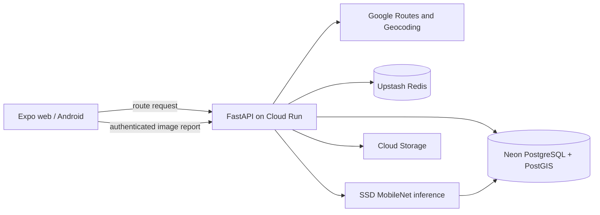

# Pathfinder

**Road-aware route recommendations from crowdsourced surface reports.**

Pathfinder compares Google route candidates using travel time, distance, and road quality inferred from user-submitted images. It is an Expo/React Native application backed by FastAPI, PostGIS, and Redis.

> Release status: the production stack and deployment workflows are ready. Public web, API, and Android links are added only after the `v1.0.0` deployment and production benchmark pass.

## What it does

- Routes guests without an account; authentication is required only to contribute reports.
- Runs a pretrained SSD MobileNet road-damage detector when a report is submitted.
- Stores spatial observations in indexed PostGIS geography columns.
- Samples each route corridor every 50 metres and measures quality coverage within 30 metres.
- Ranks alternatives using 25% distance, 35% duration, and 40% coverage-adjusted road quality.
- Caches recommendations in Redis and invalidates them when new road data becomes ready.
- Runs as the same Expo codebase on Android and the web.

## Architecture



CV runs at ingestion time, never in the navigation hot path. Missing Redis degrades to direct computation; sparse road data is shrunk toward a neutral quality score so a single report cannot dominate a route.

## Run locally

Prerequisites: Python 3.11, Node 22, Docker Desktop, and optional restricted Google/Firebase keys.

```powershell
Copy-Item .env.example backend/.env

docker compose up -d
py -3.11 -m venv .venv
.\.venv\Scripts\python -m pip install -r backend/requirements-dev.txt
Push-Location backend
..\.venv\Scripts\alembic upgrade head
..\.venv\Scripts\python -m app.seed
..\.venv\Scripts\python -m uvicorn main:app --reload
Pop-Location

Push-Location mobile
npm ci
npm start
```

Without Google keys, the API exposes a safe Bengaluru demo for Cubbon Park, Indiranagar, Koramangala, and Majestic. Seeded observations are explicitly marked `is_demo`; they are never represented as genuine crowdsourced data.

## API and verification

Interactive OpenAPI documentation is available at `/docs`. The stable surface is under `/api/v1`:

- `POST /routes/recommend`
- `GET /places/geocode`
- `GET /reports`
- `POST /reports` (Firebase bearer token required)
- `GET /reports/me`
- `GET /health`

```powershell
.\.venv\Scripts\python -m ruff check backend/app backend/migrations backend/tests
.\.venv\Scripts\python -m pytest backend/tests
Set-Location mobile
npm run typecheck
npm run build:web
```

The numerical resume claim is gated by `backend/scripts/benchmark_geospatial.py`. It loads a real PostGIS query, reports p50/p95/p99, and fails if p95 reaches 200 ms. Google network latency is measured separately and is not presented as database processing time.

## Model provenance

The model artifact comes from the University of Tokyo Sekimoto Lab [RoadDamageDetector](https://github.com/sekilab/RoadDamageDetector) work. Runtime responses include its SHA-256-derived version. See [the model card](backend/MODEL_CARD.md) for classes, licensing, and limitations. It supports a recommendation heuristic; it does not certify road safety.

## Deployment and security

The repository contains Cloud Build, Cloud Run, Firebase Hosting, EAS, and keyless GitHub Actions configurations. Production uses separate API-restricted browser, Android, and server Google credentials. Populated environment files, service-account keys, generated builds, and uploads are excluded from Git.

See [deployment](docs/DEPLOYMENT.md), [performance evidence](docs/PERFORMANCE.md), and the generated [OpenAPI contract](http://localhost:8000/docs).

## Contributors

Pathfinder began as a team project. Historical work remains attributed in Git to Vivek G, Sahil Gupta, and kr-coder24. The 2026 production architecture, routing hardening, cross-platform redesign, benchmark gate, and deployment workflow are maintained by Vivek G. This repository preserves the original collaborative history rather than rewriting it.

## License

MIT for repository code. The model and its training dataset retain their upstream terms; consult the model card before redistribution.
